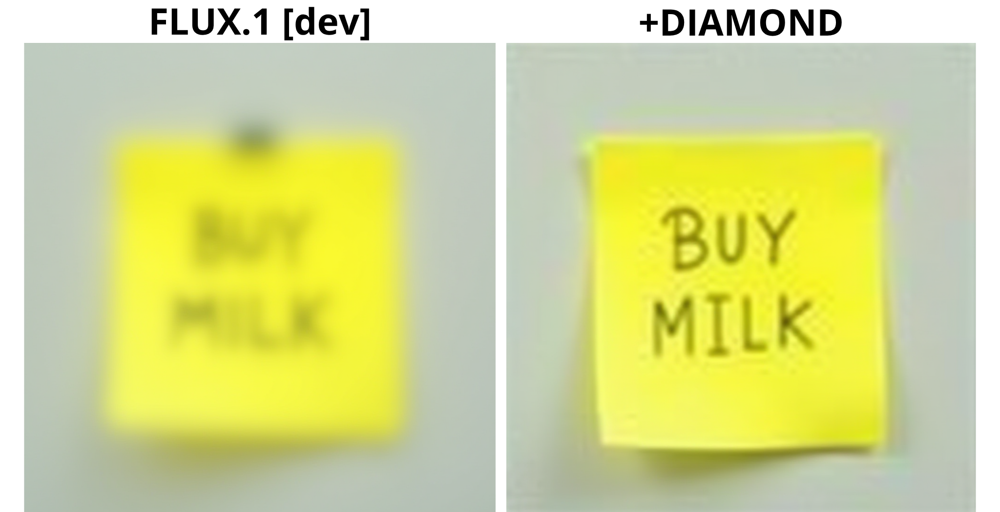
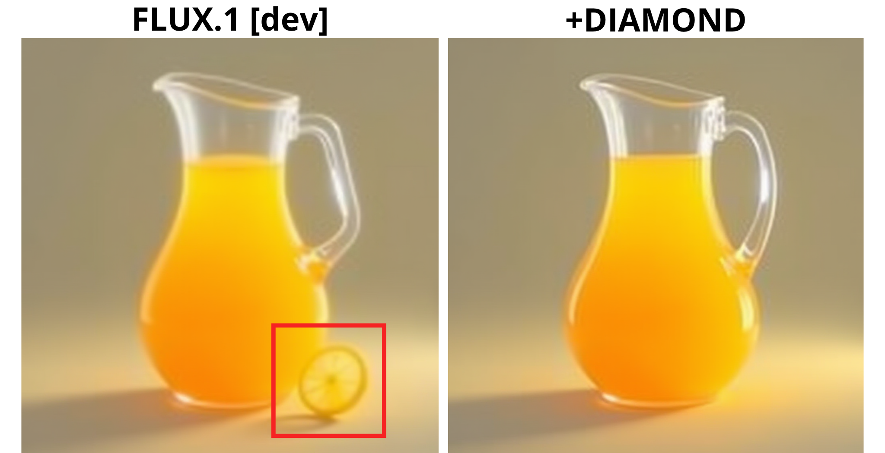
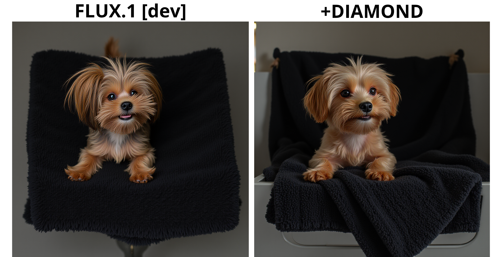
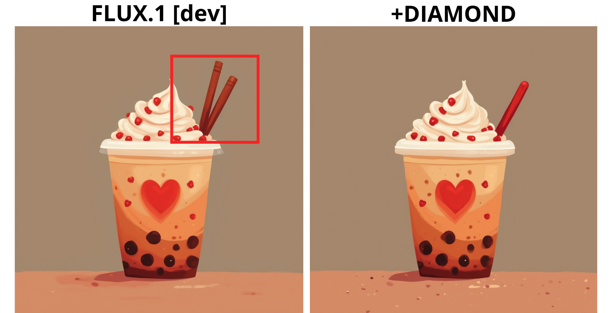

Examples of Non-Humanoid, Structurally Distorted, and Non-Physical Artifacts
 
**Artifact type**: Blur/text degradation, **Prompt:** ["a yellow sticky note with 'BUY MILK' written on it"]

**Artifact type**: Artifact type: Structural distortion (object geometry/bottle shape inconsistencies), **Prompt:** ["bottles"]
 

**Artifact type**: Artifact type: Non-physical composition (floating object / violated physics), **Prompt:** ["a pitcher of orange juice"]
 

**Artifact type**: Artifact type: Unrealistic scene / physical inconsistency (levitation, unsupported object), **Prompt:** ["a black towel with a dog on it"]
 

**Artifact type**: Artifact type: Structural inconsistency (object configuration, e.g., incorrect number of elements like straws) **Prompt:** ["a lovestruck cup of boba"]
 
